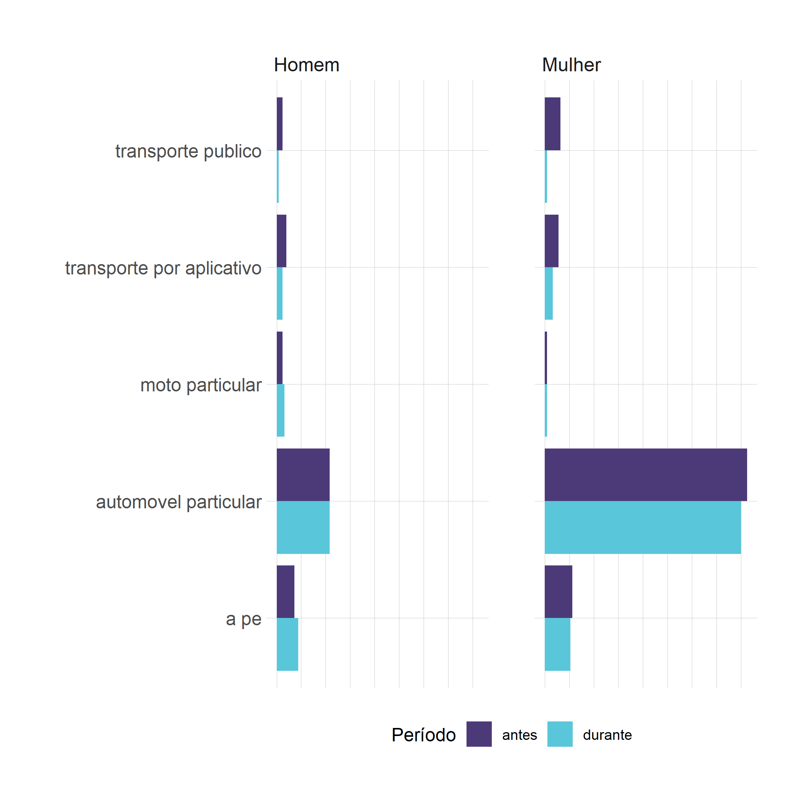
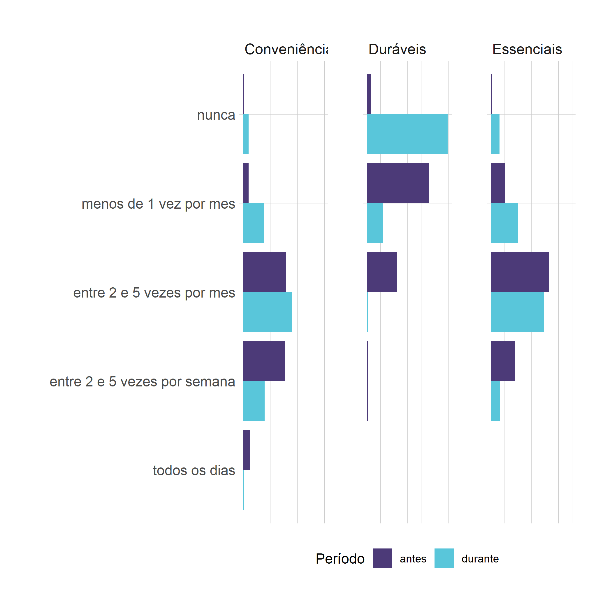

```{r setup, include=FALSE}
knitr::opts_chunk$set(warning = FALSE, message = FALSE)
# options(knitr.table.format = "html")
library(tidyverse)
library(fontawesome) # from github: https://github.com/rstudio/fontawesome
library(plotly)
```


layout: true
  
<div class="my-footer"><span>places.education</span></div>

<!-- this adds the link footer to all slides, depends on my-footer class in css-->

---
name: xaringan-title
class: left, middle, inverse
background-image: url(img/forum_banner.png)
background-position: top
background-size: none

.middle[
.huge[

Mudanças nos deslocamentos para compras durante a Pandemia COVID-19 - Belo Horizonte

]

Renata Oliveira | 17/11/2021
]

???

Obrigada pela oportunidade. 

Parabéns pela iniciativa dos eventos necessários para a sociedade.

<!-- this ends up being the title slide since seal = FALSE-->

---
class: left, inverse

background-image: url(img/agenda2.jpg)
background-position: top
background-size: none

.pull-left[
.extrahuge[
AGENDA
]]

.pull-right[
]

???

Agenda de hoje

---

class: left, inverse

background-image: url(img/agenda3.png)
background-position: top
background-size: none

.pull-left[
.extrahuge[
AGENDA
]]

.pull-right[
.middle[
.gray[
1. Equipe

2. Contexto

3. Objetivos

4. Materiais e métodos

5. Resultados

6. Considerações finais e próximas análises
]]]


---
class: left, inverse

background-image: url(img/people.jpg)
background-position: top
background-size: cover

.pull-left[
.extrahuge[
EQUIPE
]]

.pull-right[

]


---
class: left, inverse

background-image: url(img/people3.jpg)
background-position: top
background-size: none

.pull-left[
.extrahuge[
EQUIPE
]]

.pull-right[
.gray[
.middle[

Renata Oliveira (CEFET-MG)
 
Lílian Bracarense (UFT)

Tainá Possas (CEFET-MG)

Pedro Linhares (CEFET-MG)

Almir Júnior (CEFET-MG)

]]]

---
class: left, inverse

background-image: url(img/shop3.jpg)
background-size: cover

.extrahuge[
CONTEXTO
]

---

# Contexto

- Pandemia - COVID-19

- Disrupção dos padrões de demanda urbana e hábitos de consumo

- Incapacidade de manutenção dos instrumentos de planejamento - previsão de demanda a partir de dados históricos

- Paradigma de planejamento orientado ao acesso a oportunidades nas cidades

- Encadeamento de viagens como forma de mitigação dos impactos advindos das soluções de último quilômetro

???

Vivemos um período excepcional que não tínhamos vivenciado antes. Entretanto, a pandemia se mostrou catalizadora de processos já em curso devido à 4a revolução industrial, como a digitalização das relações sociais e econômicas e as conseguentes mudanças nos padrões de demanda por funções urbanas e hábitos de consumo. 

Nesse contexto disruptivo, existem lacunas metodológicas importantes, em especial as relacionadas à incapacidade de previsão. Michael Batty, em seu editorial de 2020, intitulado "Unpredictability", discute exatamente a impossibilidade de seguirmos trabalhando com modelos de planejamento das cidades fundamentados em previsão do futuro. As cidades estão se tornando mais complexas à medida que evoluem e à medida que as populações humanas adquirem cada vez mais tecnologias que continuamente lhes fornecem novos conjuntos de oportunidades. Neste sentido, nada é previsível. Imprevisibilidade é o novo normal.

Temos, portanto, que revisar a estrutura de pensamento que rege o planejamento das cidades. Nesse contexto, podemos pensar na proposta de planejamento orientado ao acesso às oportunidades, com foco na redução de iniquidades socioespaciais. E a movimentação de mercadorias, com importância relativa da entrega domiciliar consolidada pela pandemia, é parte essencial desse planejamento.

A contribuição de soluções de último quilômetro para a redução da emissão de GEE pode ser comprometida pelos novos hábitos. Como exemplo, tem-se o encadeamento de viagens para acesso a pontos de coleta e entrega (ou pickup points). Apesar de diferentes autores terem investigado os PCEs, especialmente no contexto europeu, não há consenso em relação aos impactos gerais desses sistemas nas cidades e à maneira como os consumidores se deslocam para acesso aos (Verlinde et al. 2019). 

Assim, o estudo individualizado dessa temática torna-se importante para identificação dos impactos desses sistemas em cada contexto urbano de aplicação, justificando, portanto, a relevância do presente trabalho para a comunidade acadêmica e a sociedade belo-horizontina em uma forma geral.

Edwards et al. (2010) atestou, por exemplo, que se os consumidores forem coletar seus produtos de carro ou de ônibus, a emissão de CO2 representaria boa parte da emissão total de um entrega convencional. Em contrapartida, Pålsson et al. (2017) afirma que o uso de automóveis individuais para realizar coletas em PCEs representa um consumo final de energia maior do que se a entrega fosse realizada em domicílio. Cardenas et al. (2017) calculou que a quantidade de viagens realizadas para coletar esses produtos de carro demandam um acréscimo de Pick-up Points em certas áreas para equilibrar os custos econômicos e ambientais, validando a perspectiva de que é necessário um planejamento integrado das cidades, considerando os sistemas de mobilidade e a estrutura espacial das oportunidades.


---

# Contexto
## Públicação deste estudo até o momento

.pull-left-narrow[
```{r echo=FALSE, message=FALSE, warning=FALSE}

```
]

.pull-right-wide[
.small[
- Cidadãos com **menor escolaridade**, **autônomos** e que exercem **deslocamentos menos frequentes** **mudaram menos** sua rotina com motivo **trabalho**.
- **Jovens** com **menor escolaridade** ou **menor renda** **mantiveram** os deslocamentos por **motivo educação e compras**. 
- Cidadãos com **maior escolaridade** apresentam **melhores chances** de manter **atividades essenciais** **sem deslocamento**, incluindo por **motivo compras**. 
- Usuários de **transporte público** apresentaram **menos oportunidades** de **mudar os padrões** de deslocamento por motivo **compras**. 
- As **intenções** dos cidadãos quanto aos deslocamentos **após a pandemia** são **estatisticamente dependentes** das **características** das atividades.

]]

???
- Cidadãos com **menor escolaridade**, **autônomos** e que exercem **deslocamentos menos frequentes** **mudaram menos** sua rotina com motivo **trabalho**.
- **Jovens** com **menor escolaridade** ou **menor renda** **mantiveram** os deslocamentos por **motivo educação e compras**. 
- Cidadãos com **maior escolaridade** apresentam **melhores chances** de manter **atividades essenciais** **sem deslocamento**, incluindo por **motivo compras**. 
- Usuários de **transporte público** apresentaram **menos oportunidades** de **mudar os padrões** de deslocamento por motivo **compras**. 
- As **intenções** dos cidadãos quanto aos deslocamentos **após a pandemia** são **estatisticamente dependentes** das **características** das atividades.

---

class: left,  middle

background-image: url(img/fluxo.png)
background-size: none


---

class: left,  middle

background-image: url(img/fluxo1.png)
background-size: none


---
class: left, inverse

background-image: url(img/shop1.jpg)
background-size: cover

.extrahuge[
OBJETIVOS
]

---

# Objetivos

- **Caracterizar** os **deslocamentos dos consumidores** antes e durante a pandemia COVID19;
<br></br>

--

- **Relacionar** as características **socioeconômicas e demográficas** com os padrões de **deslocamentos para compras** antes e durante a pandemia COVID19;
<br></br>

--

- **Caracterizar** as **mudanças** em relação às **viagens encadeadas** visando compras no contexto da pandemia COVID19;
<br></br>

--

.pink-faint[
- Identificar possíveis desigualdades e iniquidades socioespaciais considerando o acesso nos deslocamentos para compras antes e durante a pandemia COVID19;

]
---

class: left, inverse

background-image: url(img/street1.jpg)
background-size: cover

.extrahuge[
MATERIAIS E MÉTODOS
]


---

# Materiais e métodos

.pull-left[
## Perfil amostral

- Coleta realizada em **Maio/2020**
- Método de coleta: _Survey_ na **web**
- Amostra: **208 respostas** para BH
- Observações validadas: **181 respostas**
- Erro amostral: **6,11%** 
- Nível de confiança de **90%**.
]

.pull-right[
```{r echo=FALSE, message=FALSE, warning=FALSE}

```
]

---

# Materiais e métodos


.pull-left[
## Perfil amostral
- 74% mulheres
- 26% homens
]

.pull-right[
```{r echo=FALSE, message=FALSE, warning=FALSE}
knitr::include_graphics("img/genero_idade.png")
```
]


---

# Materiais e métodos


.pull-left[
## Perfil amostral
- 25% - ensino médio
- 27% - ensino superior
- 28% - pós-graduação lato-sensu
- 20% - mestrado ou doutorado
]

.pull-right[
```{r echo=FALSE, message=FALSE, warning=FALSE}

```
]

---

# Materiais e métodos


.pull-left[
## Perfil amostral
- 31% - empresa privada
- 23% - servidor público
- 19% - estudante
- 19% - autônomos
]

.pull-right[
```{r echo=FALSE, message=FALSE, warning=FALSE}
knitr::include_graphics("img/genero_prof.png")
```
]

---

# Materiais e métodos


.pull-left[
## Perfil amostral
- 39% - renda acima de 5 mil e contribuem
- 18% - renda entre 1,5 mil e 3,0 mil e contribuem
- 16% - renda abaixo de 1,5 mil e são dependentes
]

.pull-right[
```{r echo=FALSE, message=FALSE, warning=FALSE}
knitr::include_graphics("img/genero_renda.png")
```
]

---

# Materiais e métodos


.pull-left[
## Perfil amostral
- 50% dos respondentes em isolamento total são pessoas de risco ou moram com alguém de risco para COVID19.
- 58% dos respondentes estava em isolamento total.
- Menos de 1% das pessoas em risco estão sem nenhum isolamento.
]

.pull-right[
```{r echo=FALSE, message=FALSE, warning=FALSE}

```
]

---

# Materiais e métodos

## Métodos de análise

- Análise Exploratória de Dados - estatísticas descritivas não espaciais e espaciais

- Teste Chi-Quadrado

- Teste Fisher

- LISA (Indicadores Locais de Autocorrelação espacial) uni e bivariado

- Regressão espacial


---

# Materiais e métodos

## Métodos de análise

- Análise Exploratória de Dados - estatísticas descritivas não espaciais e espaciais

.pink-faint[
- Teste Chi-Quadrado

- Teste Fisher

- LISA (Indicadores Locais de Autocorrelação espacial) uni e bivariado

- Regressão espacial
]

---

class: left, inverse

background-image: url(img/street4.jpg)
background-size: cover

.extrahuge[
RESULTADOS
]

---

# Resultados
## **Frequência de deslocamentos** - compras e serviços

.pull-left[
.center[
**Compras**   
```{r echo=FALSE, message=FALSE, warning=FALSE, out.width="90%"}

```
]]

.pull-right[
.center[
**Serviços**   
```{r echo=FALSE, message=FALSE, warning=FALSE, out.width="90%"}
knitr::include_graphics("img/freq_servico.png")
```
]]

???

Homens e mulheres reduziram a frequencia de deslocamentos para compras no geral

A manutenção de deslocamentos para serviços foi também predominante para os dois gêneros, sem alteração daqueles eventuais. 


---

# Resultados
## **Modos de transporte** - compras e serviços


.pull-left[
.center[
**Compras**
```{r echo=FALSE, message=FALSE, warning=FALSE, out.width="90%"}

```
]]

.pull-right[
.center[
**Serviços**
```{r echo=FALSE, message=FALSE, warning=FALSE, out.width="90%"}
knitr::include_graphics("img/modo_genero4.png")
```
]]

???

Homens mantiveram o uso de automóvel particular para deslocamentos para compras e mulheres reduziram o uso de todos os modos. Entretanto, homens aumentaram o uso de moto particular e deslocamentos ativos. 

Para serviços, houve redução de todos os modos utilizados, por homens e mulheres. 


---

# Resultados
## **Frequência e Encadeamento** dos deslocamentos

.pull-left[
.center[
**Frequência**
```{r echo=FALSE, message=FALSE, warning=FALSE, out.width="90%"}

```
]]

.pull-right[
.center[
**Encadeamento**
```{r echo=FALSE, message=FALSE, warning=FALSE, out.width="90%"}

```

]]


???

Observando os deslocamentos por tipo de produtos, aqueles para compra de produtos de conveniência (farmácia, padaria) e de produtos essenciais (supermercado) sofreram redução. Mas essa redução foi mais expressiva nos deslocamentos para compra de bens duráveis.

Um fato importante em relação à efetividade e mitigação de impactos advindos da distribuição urbana de mercadorias é a redução expressica do encadeamento de viagens por motivo compras. Sem esse encadeamento, soluções como pontos de coleta e entrega podem se tornar mais onerosos para o contexto urbano do que a entrega domiciliar tradicional.  

---

# Resultados
## **Frequência de compras** pela **internet**
.center[
```{r echo=FALSE, message=FALSE, warning=FALSE, out.width="47%"}
knitr::include_graphics("img/internet_bens.png")
```
]

???

Durante a pandemia observou-se um aumento da utilização de internet para compras de produtos de conveniência, essenciais e bens duráveis. Esse aumento precisa ser detalhado relacionando atributos socioeconômicos e demográficos ao padrão de compras online. 

---

# Resultados
## **Fatores de escolha** - _E-commerce_

.center[
**Antes**   
```{r echo=FALSE, message=FALSE, warning=FALSE, out.width="80%"}

```
]

???
Houve pouca alteração da percepção dos consumidores quanto aos fatores relevantes para a decisão quanto à compra online. Entretanto destacam-se a possibilidade de não ter contato com o prestador de serviço no momento da entrega e a possibilidade de retirada em loja física no menor prazo. 

---

# Resultados
## **Fatores de escolha** - _E-commerce_


.center[
**Durante**   
```{r echo=FALSE, message=FALSE, warning=FALSE, out.width="80%"}
knitr::include_graphics("likert_depois.png")
```
]

???


---

class: left, inverse

background-image: url(img/street2.jpg)
background-size: cover

.extrahuge[
CONSIDERAÇÕES FINAIS
]

---
# Considerações finais

- Desequilíbrio entre oferta e demanda por produtos
--

- Cadeia de abastecimento global
--

- _E-commerce_ e mercado imobiliário logístico
--

- Necessidade de mão-de-obra para retorno ao funcionamento de estabelecimentos comerciais em horário pleno - serviços
--

- Impacto e efetividade das soluções de logística urbana em concomitância com a redução de deslocamentos - teletrabalho e ensino remoto
--

- Demanda por mercadorias como resultado do comportamento humano e da estrutura urbana - Gestão da demanda
--


---

class: right, middle, inverse

.center[
.huge[
# MUITO OBRIGADA!
]]

[`r fa(name = "twitter")` @retaoliveira](http://twitter.com/retaoliveira)  
[`r fa(name = "github")` @retaoliveira](http://github.com/retaoliveira)  
[`r fa(name = "link")` retaoliveira.github.io/places](https://retaoliveira.github.io/places)  
[`r fa(name = "paper-plane")` renataoliveira@cefetmg.br](mailto:renataoliveira@cefetmg.br)


