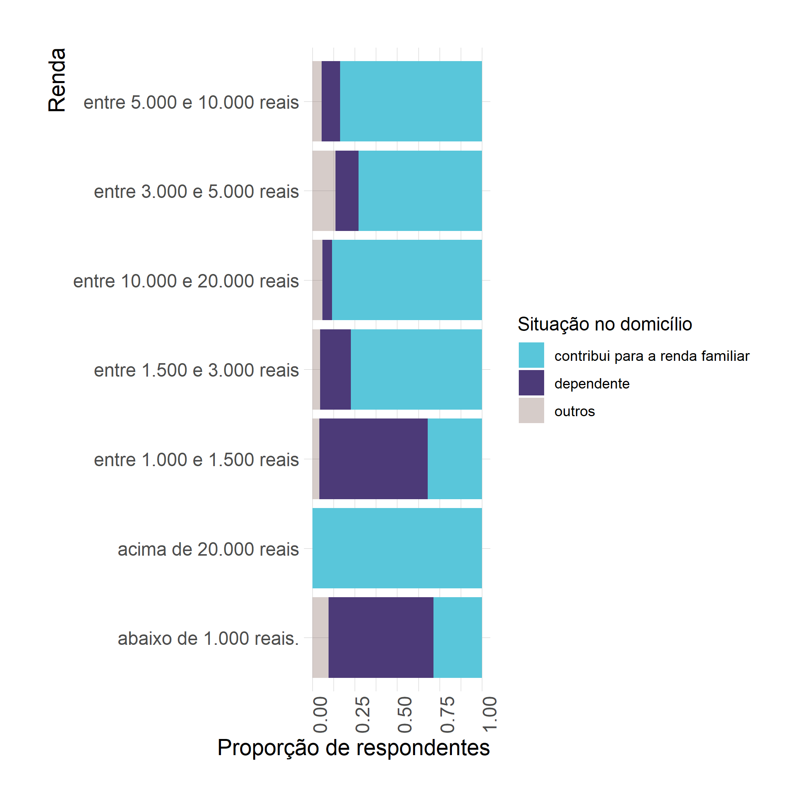

```{r setup, include=FALSE}
knitr::opts_chunk$set(warning = FALSE, message = FALSE)
# options(knitr.table.format = "html")
library(tidyverse)
library(fontawesome) # from github: https://github.com/rstudio/fontawesome
library(plotly)
```


layout: true
  
<div class="my-footer"><span>places.education</span></div>

<!-- this adds the link footer to all slides, depends on my-footer class in css-->

---
name: xaringan-title
class: left, middle, inverse
background-image: url(img/forum_banner.png)
background-position: top
background-size: none

.middle[
.huge[

Mudanças nos deslocamentos para compras durante a Pandemia COVID-19 - Belo Horizonte

]

Renata Oliveira | 17/11/2021
]

<!-- this ends up being the title slide since seal = FALSE-->

---
class: left, inverse, middle

background-image: url(img/agenda2.jpg)
background-position: top
background-size: none

.pull-left[
.extrahuge[
AGENDA
]]

---

class: left, inverse, middle

background-image: url(img/agenda3.png)
background-position: top
background-size: none

.pull-left[
.extrahuge[
AGENDA
]]

.gray[
.pull-right[
1. Equipe
2. Contexto
3. Objetivos
4. Materiais e métodos
5. Resultados
6. Próximas análises
]]


---
class: left, inverse, middle

background-image: url(img/people.jpg)
background-position: top
background-size: cover

.pull-left[
.extrahuge[
EQUIPE
]]

---
class: left, inverse, middle

background-image: url(img/people3.jpg)
background-position: top
background-size: none

.pull-left[
.extrahuge[
EQUIPE
]]

.gray[
.pull-right[

Renata Oliveira (CEFET-MG)
 
Lílian Bracarense (UFT)

Tainá Possas (CEFET-MG)

Pedro Linhares (CEFET-MG)

Almir Júnior (CEFET-MG)

]]

---
class: left, inverse, middle

background-image: url(img/shop3.jpg)
background-size: cover

.extrahuge[
CONTEXTO
]

---
O acesso às atividades urbanas durante a pandemia de Covid-19 e seus impactos sobre mobilidade urbana: O contexto brasileiro caracterizamos a diferenciação de acesso às atividades essenciais dentro das cidades brasileiras durante o distanciamento social e a intenção de manter mudanças de comportamento relativas a estas atividades no período pós-pandêmico.**

Cadeia de viagens e hábitos de consumo


---
class: left,  middle, inverse

background-image: url(img/fluxo.png)
background-size: none


---
class: left, inverse, middle

background-image: url(img/shop1.jpg)
background-size: cover

.extrahuge[
OBJETIVOS
]

---

# Objetivos

- **Caracterizar** os **deslocamentos dos consumidores** antes e durante a pandemia COVID19;

--

- **Relacionar** as características **socioeconômicas e demográficas** com os padrões de **deslocamentos para compras** antes e durante a pandemia COVID19;

--

- **Caracterizar** as **mudanças** em relação às **viagens encadeadas** visando compras no contexto da pandemia COVID19;

--

.pink-faint[
- Identificar possíveis desigualdades e iniquidades socioespaciais considerando o acesso nos deslocamentos para compras antes e durante a pandemia COVID19;
]
---

class: left, inverse, middle

background-image: url(img/street1.jpg)
background-size: cover

.extrahuge[
MATERIAIS E MÉTODOS
]


---

# Materiais e métodos

.pull-left[
## Perfil amostral

- Coleta realizada em **Maio/2020**
- Método de coleta: _Survey_ na **web**
- Amostra: **208 respostas** para BH
- Observações validadas: **181 respostas**
- Erro amostral: **6,11%** 
- Nível de confiança de **90%**.
]

.pull-right[
```{r echo=FALSE, message=FALSE, warning=FALSE}
knitr::include_graphics("img/amostra.png")
```
]

---

# Materiais e métodos


.pull-left[
## Perfil amostral
- 74% mulheres
- 26% homens
]

.pull-right[
```{r echo=FALSE, message=FALSE, warning=FALSE}
knitr::include_graphics("img/genero_idade.png")
```
]


---

# Materiais e métodos


.pull-left[
## Perfil amostral
- 25% - ensino médio
- 27% - ensino superior
- 28% - pós-graduação lato-sensu
- 20% - mestrado ou doutorado
]

.pull-right[
```{r echo=FALSE, message=FALSE, warning=FALSE}
knitr::include_graphics("img/genero_educa.png")
```
]

---

# Materiais e métodos


.pull-left[
## Perfil amostral
- 31% - empresa privada
- 23% - servidor público
- 19% - estudante
- 19% - autônomos
]

.pull-right[
```{r echo=FALSE, message=FALSE, warning=FALSE}
knitr::include_graphics("img/genero_prof.png")
```
]

---

# Materiais e métodos


.pull-left[
## Perfil amostral
- 39% - renda acima de 5 mil e contribuem
- 18% - renda entre 1,5 mil e 3,0 mil e contribuem
- 16% - renda abaixo de 1,5 mil e são dependentes
]

.pull-right[
```{r echo=FALSE, message=FALSE, warning=FALSE}

```
]

---

# Materiais e métodos


.pull-left[
## Perfil amostral
- 50% dos respondentes em isolamento total são pessoas de risco ou moram com alguém de risco para COVID19.
- 58% dos respondentes estava em isolamento total.
- Menos de 1% das pessoas em risco estão sem nenhum isolamento.
]

.pull-right[
```{r echo=FALSE, message=FALSE, warning=FALSE}
knitr::include_graphics("img/isolamento_risco.png")
```
]

---

# Materiais e métodos

## Métodos de análise


----
class: right, middle, inverse


# Find me at...

[`r fa(name = "twitter")` @retaoliveira](http://twitter.com/retaoliveira)  
[`r fa(name = "github")` @retaoliveira](http://github.com/retaoliveira)  
[`r fa(name = "link")` retaoliveira.github.io/places](https://retaoliveira.github.io/places)  
[`r fa(name = "paper-plane")` renataoliveira@cefetmg.br](mailto:renataoliveira@cefetmg.br)


